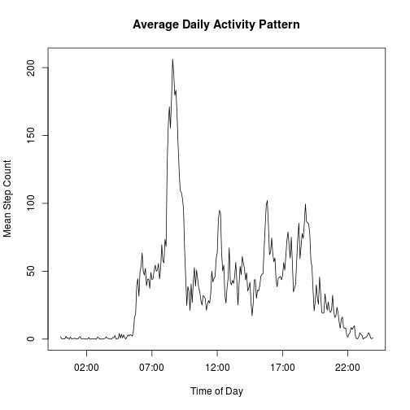

# Assignment 1 for Reproducible Research Module


## Loading and preprocessing the data

The data are in a CSV file and require no special arguments to load and no
processing after they are loaded. However, for convenience, we can add two new
variables now that will be useful later on.

* day_type: a factor marking each date as a "weekend" day or a "weekday".
* time:     a character string translating each interval to a time of day.


```r
# Load the libraries that we'll need.
library("lattice")
library("dplyr", warn.conflicts=FALSE)

# Load the data.
act <- as.tbl(read.csv("activity.csv"))

# Later we'll need some date/time information. Let's add those now.
act <- mutate(act,
           # Figure out the day of the week for each date.
           wday       = weekdays(strptime(date,"%Y-%m-%d")),
           # Use a TRUE/FALSE flag to mark each day as weekend or not.
           is_weekend = wday %in% c("Saturday","Sunday"),
           # Convert the boolean flag to a factor.
           day_type   = as.factor(ifelse(is_weekend,"weekend","weekday")),

           # Left pad all the intervals to four spaces with "0"s.
           lpad_int   = sprintf("%04d", interval),
           # Use that left padding to convert to a "HH:MM" format time string.
           t_string   = paste0(substr(lpad_int,1,2), ":", substr(lpad_int,3,4)),
           # Convert the time string to a factor.
           time       = as.factor(t_string)
        ) %>%
        # Drop the intermediate variables that we won't need.
        select(-wday, -is_weekend, -lpad_int, -t_string)
```


## What is the mean total number of steps taken per day?

We can explore the data by looking at how many steps were taken per day, and how
much this varied. This is best illustrated by a histogram.


```r
# Calculate the total steps per day.
steps_per_day <- tapply(act$steps, act$date, sum, na.rm=TRUE)

# Draw the histogram.
hist(
    steps_per_day,
    main="Histogram of Total Steps per Day",
    xlab="Steps per Day"
)
```

 

```r
# Save the mean and median for use in the report.
daily_mean   <- format(mean(steps_per_day, na.rm=TRUE), nsmall=2, big.mark=",")
daily_median <- format(median(steps_per_day, na.rm=TRUE), big.mark=",")
```

* Mean total steps per day: 9,354.23.
* Median total steps per day: 10,395.


## What is the average daily activity pattern?

It is also intesting to consider whether, and how, the number of steps taken
varied over the course of an average day. We can make a time series plot of the
mean number of steps taken per interval.


```r
# Calculate the mean number of steps for each interval.
mean_int_steps <- tapply(act$steps, act$interval, mean, na.rm=TRUE)

# Plot the average daily pattern against the interval formatted as time of day.
plot(
    # Convert act$time to POSIXlt objects so that plot() can make sense of it.
    strptime(levels(act$time), "%H:%M"),
    mean_int_steps,
    type="l",
    xlab="Time of Day",
    ylab="Mean Step Count",
    main="Average Daily Activity Pattern"
)
```

 

```r
# Find the index of the largest mean_int_step value.
max_index <- which.max(mean_int_steps)
# Get the corresponding act$time value.
busiest   <- levels(act$time)[max_index]
# And the value just after that.
after     <- levels(act$time)[max_index + 1]
# Format the maximum mean_int_step value for the report.
scount    <- round(max(mean_int_steps), 0)
```

On average, across all the days, the interval with the most steps is
08:35 - 08:40, with 206 steps.

## Imputing missing values

There are many missing values. We need to know how many and to consider whether
they are having a signicant effect on our calculations.


```r
# Calculate the number of missing step values.
na_count <- format(sum(is.na(act$steps)), big.mark=",")
```

The number of missing values is 2,304.

Create a new data set, based on the one we read from the CSV file, but with
missing values imputed by replacing them with the median value for their
interval. We'll use the median rather than the mean as this will give us a whole
number, which makes more sense with counts of steps.

Then plot a histogram of the total steps per day as we did with the original
data set.


```r
# Make a new data set, replacing each missing value with the median value for
# that interval.
imp_act <- group_by(act, interval) %>%
           mutate(
               steps=ifelse(is.na(steps), median(steps, na.rm=TRUE), steps)
           )

# As before, calculate the total number of steps per day.
imp_steps_per_day <- tapply(imp_act$steps, imp_act$date, sum, na.rm=TRUE)

# And draw a histogram.
hist(
    imp_steps_per_day,
    main="Histogram of Total Steps per Day (NAs Imputed)",
    xlab="Steps per Day"
)
```

 

```r
# Calculate new mean and median values.
imp_mean   <- format(mean(imp_steps_per_day),   nsmall=2, big.mark=",")
imp_median <- format(median(imp_steps_per_day), nsmall=2, big.mark=",")

# Report the sum after imputation for days that had all NAs before imputation.
new_sum <- format(
    sum(tapply(act$steps, act$interval, median, na.rm=TRUE)), big.mark=","
)
```

### After Imputation of Missing Values
* Mean Total Steps per Day: 9,503.869
* Median Total Steps per Day: 10,395

The median value is unchanged by this method of imputation while the mean value
is now slightly higher than the value calculated before imputation.

This reflects the presence in the data set of entire days with no data for the
steps variable. Before imputation these days would have been represented as
"0" in the calculation of steps per day, but after imputation they are reprented
by the sum of the median values for all the intervals in the day, thus raising
the mean total steps per day, but leaving the median unaffected.

There is no visible change in the two histograms because this value is quite
small (1,141) and would only show up with a much higher number of bins in
the histogram.

## Are there differences in activity patterns between weekdays and weekends?

We might expect that behaviour, in the sense of steps taken, might be different
on the weekend than that during the week. We can re-draw the time series plot
above, on our imputed data, but with the data split between weekdays and
weekend days.


```r
# Calculate the total number of steps per day, classified by weekday/weekend.
# (We did most of the work for this in the first section.)
x <- group_by(imp_act, day_type, time) %>%
     summarise(tot_steps=sum(steps))

# Draw a panel plot showing weekday behaviour and weekend behaviour.
xyplot(
    tot_steps ~ time|day_type,
    data=x,
    type="l",
    layout=c(1,2),
    xlab="Time of Day",
    ylab="Number of Steps",
    # Slim the number of x-axis tick marks down to a sensible number.
    scales=list(x=list(tick.number=6, at=seq(49, 241, 48)))
)
```

 

The plot shows that the number of steps is reduced overall on weekends and that,
in particular, the high peak at c. 08:35 on weekdays is absent on weekends.

