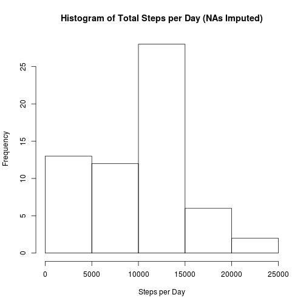
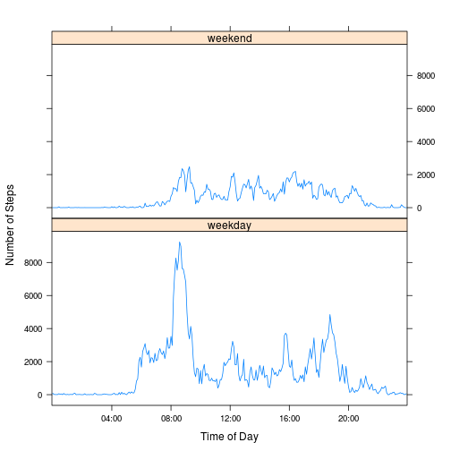

# Assignment 1 for Reproducible Research Module

## Loading and preprocessing the data

```r
# Load the libraries that we'll need.
library("lattice")
library("dplyr", warn.conflicts=FALSE)

# Load the data.
act <- as.tbl(read.csv("activity.csv"))

# Later we'll need some date/time information, let's add those now.
# day_type is a factor with levels (weekday, weekend).
# time is a string form of the interval time, e.g. "06:05".
# The other variables are temporary intermediate values.
act <- mutate(act,
           wday       = weekdays(strptime(date,"%Y-%m-%d")),
           is_weekend = wday %in% c("Saturday","Sunday"),
           day_type   = as.factor(ifelse(is_weekend,"weekend","weekday")),
           lpad_int   = sprintf("%04d", interval),
           t_string   = paste0(substr(lpad_int,1,2), ":", substr(lpad_int,3,4)),
           time       = as.factor(t_string)
        ) %>%
        select(-wday, -is_weekend, -lpad_int, -t_string)
```

## What is mean total number of steps taken per day?

```r
# Calculate the total steps per day.
steps_per_day <- tapply(act$steps, act$date, sum)

# Draw the histogram.
hist(
    steps_per_day,
    main="Histogram of Total Steps per Day",
    xlab="Steps per Day"
)
```

 

```r
# Save the mean and median for use in the report.
daily_mean   <- sprintf("%0.2f", mean(steps_per_day, na.rm=TRUE))
daily_median <- median(steps_per_day, na.rm=TRUE)
```

* Mean total steps per day: 10766.19.
* Median total steps per day: 10765.

## What is the average daily activity pattern?


```r
# Calculate the mean number of steps for each interval.
mean_int_steps <- tapply(act$steps, act$interval, mean, na.rm=TRUE)
```

This histogram shows frequencies of total steps taken per day.

```r
# Plot the average daily pattern.
plot(
    strptime(levels(act$time), "%H:%M"),
    mean_int_steps,
    type="l",
    xlab="Time of Day",
    ylab="Mean Step Count",
    main="Average Daily Activity Pattern"
)
```

 


```r
# Extract the time interval with the highest number of steps.
busiest <- levels(act$time)[mean_int_steps==max(mean_int_steps)]
scount  <- round(max(mean_int_steps), 0)
```

On average, across all the days, the interval with the most steps is 08:35 with 206 steps.

## Imputing missing values

```r
# Calculate the number of missing step values.
na_count <- format(sum(is.na(act$steps)), big.mark=",")
```

The number of missing values is 2,304.


```r
# Make a new data set, replacing each missing value with the mean for its
# interval.
imputed_act <- group_by(act, interval) %>%
               mutate(
                    steps=ifelse(is.na(steps), mean(steps, na.rm=TRUE), steps)
               )

# As before, calculate the total number of steps per day.
imp_steps_per_day <- tapply(imputed_act$steps, imputed_act$date, sum)
hist(
    imp_steps_per_day,
    main="Histogram of Total Steps per Day (NAs Imputed)",
    xlab="Steps per day"
)
```

 

```r
# Calculate new mean and median values.
imp_mean   <- sprintf("%0.2f", mean(imp_steps_per_day))
imp_median <- sprintf("%0.2f", median(imp_steps_per_day))
```


### After Imputation of Missing Values
* Mean Total Steps per Day: 10766.19
* Median Total Steps per Day: 10766.19

The mean and median are now the same. These values are the same as the mean calculated before imputing missing values (10766.19), so, other than
making the mean and the median the same, the affect of imputation in this regard
was no different than simply using the `na.rm` argument. By comparison of the
two histograms, the main effect seems to have been to increase the numbers in
each bin.

## Are there differences in activity patterns between weekdays and weekends?

```r
# Calculate the total number of steps per day, classified by weekday/weekend.
# (We did most of the work for this in the first section.)
x <- group_by(imputed_act, day_type, time) %>%
     summarise(tot_steps=sum(steps))

# Draw a panel plot showing weekday behaviour and weekend.
xyplot(
    tot_steps ~ time|day_type,
    data=x,
    type="l",
    layout=c(1,2),
    xlab="Time of Day",
    ylab="Number of Steps",
    scales=list(x=list(tick.number=5, at=seq(49,241,48)))
)
```

 

